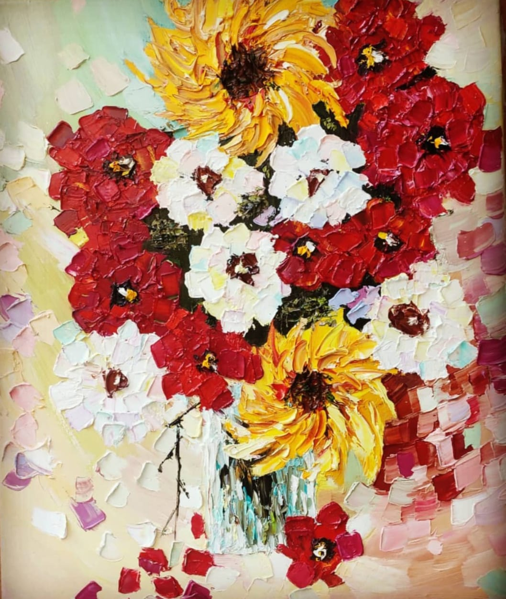
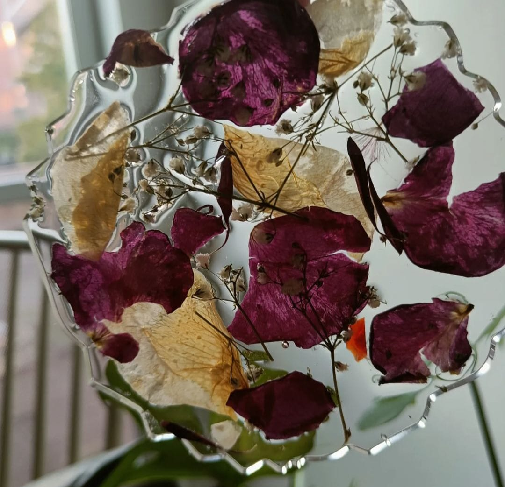
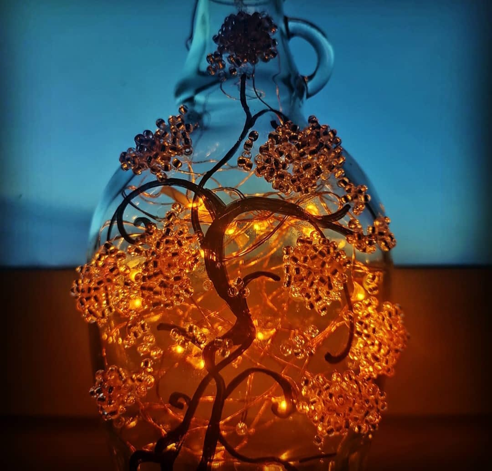

In my spare time, I enjoy painting. Here are some of them!

## Oil on canvas 

<table>
  <tr>
    <td style="text-align: center; padding: 20px;">
      
      

    </td>
    <td style="text-align: center; padding: 20px;">
      
      

    </td>
  </tr>
</table>

## Aquarelle on paper 

<table>
  <tr>
    <td style="text-align: center; padding: 20px;">
      
      

    </td>
    <td style="text-align: center; padding: 20px;">
      
      

    </td>
    
  </tr>
</table>

## Resin and glass 

<table>
  <tr>
    <td style="text-align: center; padding: 20px;">
      
      

    </td>
    <td style="text-align: center; padding: 20px;">
      
      

    </td>
  </tr>
</table>

(The first oil painting is based on the work "Fall bouquet". I thank the Afremov foundation for their kind permission to paint and display this.) 
Thank you for your interest! 

