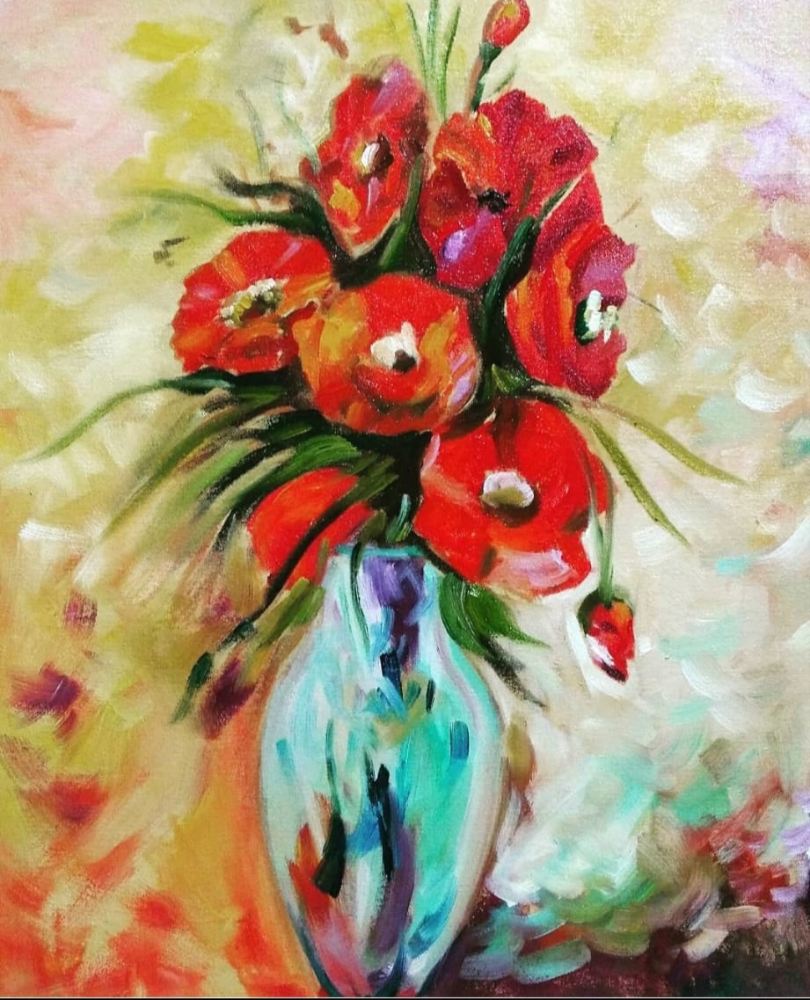
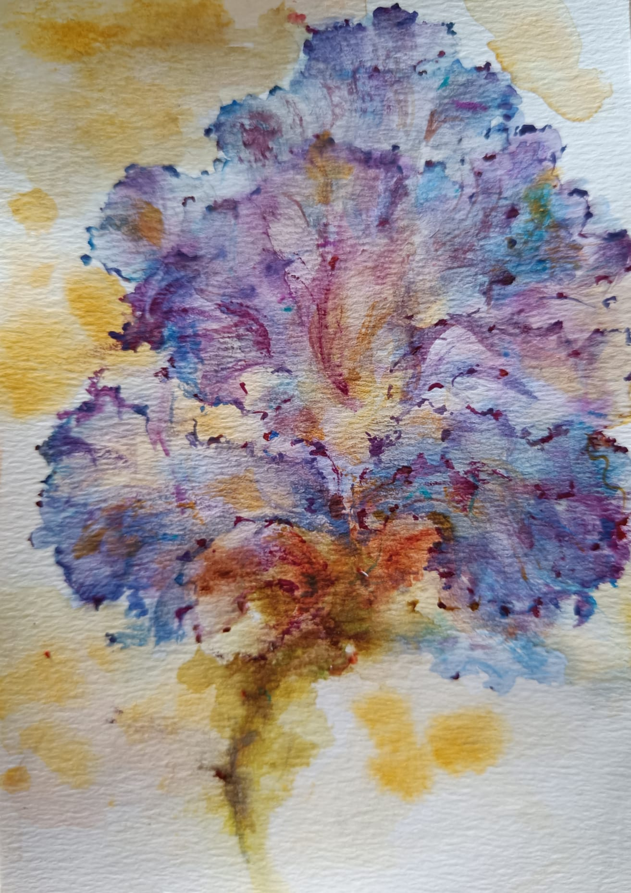

# Other Interests

In my spare time, I enjoy painting. Here are some of my paintings:

  

    
    
 - [Kungstradgarden, Stockholm (Aquarelle on paper)]

  

  

    
    
 - [This painting was based on "The Gift of Fall", I thank the Afremov foundation for their pemission to paint and display this.]

  

  

    
    
 - [Oil on canvas]

  

  

    
    
 - []

  

  

    
    
 - []

  

  

    
    
 - []

  

